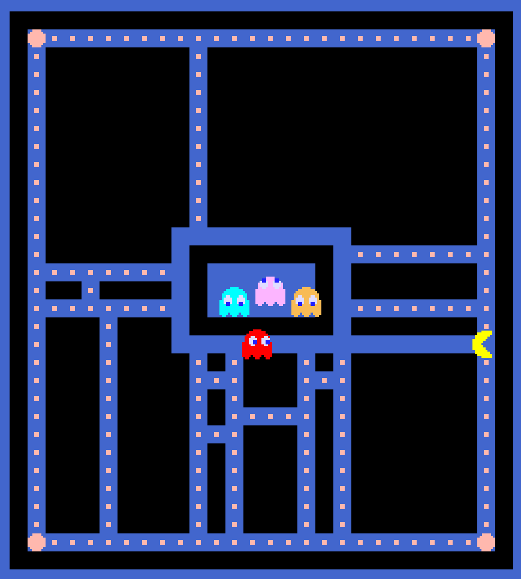
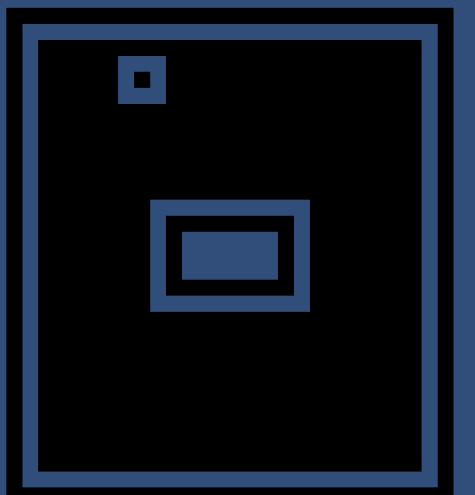

# Procedural PACMAN & Level Editor 

> A custom PACMAN implementation featuring **procedural maze generation** and an interactive **Level Editor**. Developed as coursework for the **Software Engineering Components** module (5th semester) at Kyiv Polytechnic Institute (KPI). 

---
## Overview 

Standard PACMAN games rely on static, hand-crafted maps. This project introduces high variability and replayability by dynamically generating unique maze layouts for every session while preserving classic arcade gameplay mechanics.

--- 
## Core Features & Architecture 
### 1. Procedural Level Generation (Branch Approach) 

To maximize player engagement and level variability, the maze generation uses a structured algorithmic "branch" approach: 
* **Base Template:** Generation starts with a fixed foundational layout—the central ghost house and a protective perimeter path running one square inside the outer boundary *(see Figure 1)*. 
* **Main Branches:** Random quantities and placements of main paths are extruded from the ghost house perimeter outward to the secondary outer ring *(see Figure 2)*. 
* **Sub-branching:** A dedicated struct tracks branches and sub-branches, randomly choosing segments to spawn connecting pathways up to the boundary edge. 
* **Current Limitation & Future Work:** While dead-ends and multi-width corridors are successfully filtered out, edge-case generation can occasionally isolate sections (e.g., unreachable top-left areas as seen in *Figure 4*), highlighting the need for a more advanced pathfinding/reachability validator in future updates.

### 2. Interactive Level Editor 

The engine includes a matrix-driven level editor allowing users to design custom layouts: 
* **Restricted Zones:** The ghost house and outer perimeter paths are locked (mapped to specific numeric identifiers in the underlying matrix) and cannot be edited. 
* **Editing Mechanics:** The central playable area is fully open to modification. 
	* **Left Mouse Button:** Erases a block (clears path/corridor). 
	* **Right Mouse Button:** Places a block (adds wall). 
* **Export System:** Validated custom layouts are serialized and saved automatically into the directory as sequential text files (`LevelX.txt`, where `X` is total files + 1). *Note: Loading and playing custom-saved files in-game is a work-in-progress feature.*

### 3. Gameplay & Ghost AI 

* **Objective:** Clear all dots across the maze to maximize score, true to the arcade original. 
* **Simplified AI:** Ghost behaviors are unified under a single streamlined logic script rather than individual unique states. On each turn, ghosts calculate and update their path dynamically to chase the player through the maze.

--- 

## Visualizing the Generation & Editor 
|          Base Layout & Editor Grid           |           Main Branch Generation           |     |
| :------------------------------------------: | :----------------------------------------: | --- |
|            |    |     |
| *Fixed perimeter and ghost house structure.* | *Extruded main paths from center to edge.* |     |

|           Gameplay in Action           |          Example of Generation Flaw           |     |
| :------------------------------------: | :-------------------------------------------: | --- |
|     |    |     |
| *Active game session with dynamic UI.* | *Valid paths, but top-left area is isolated.* |     |

---

## Future Improvements 

* **Advanced Reachability Validation:** Implement Flood-Fill or BFS graph traversal validation to ensure 100% of generated and user-edited floor tiles are accessible before saving/playing. 
* **Custom Level Integration:** Fully bridge the level editor output format so custom text maps can be loaded directly into the main game loop.